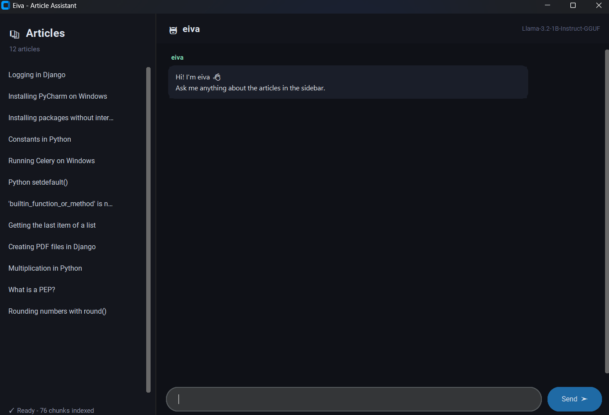
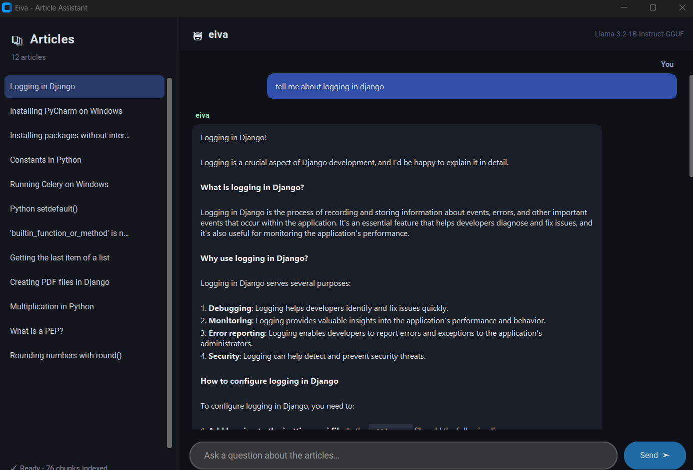
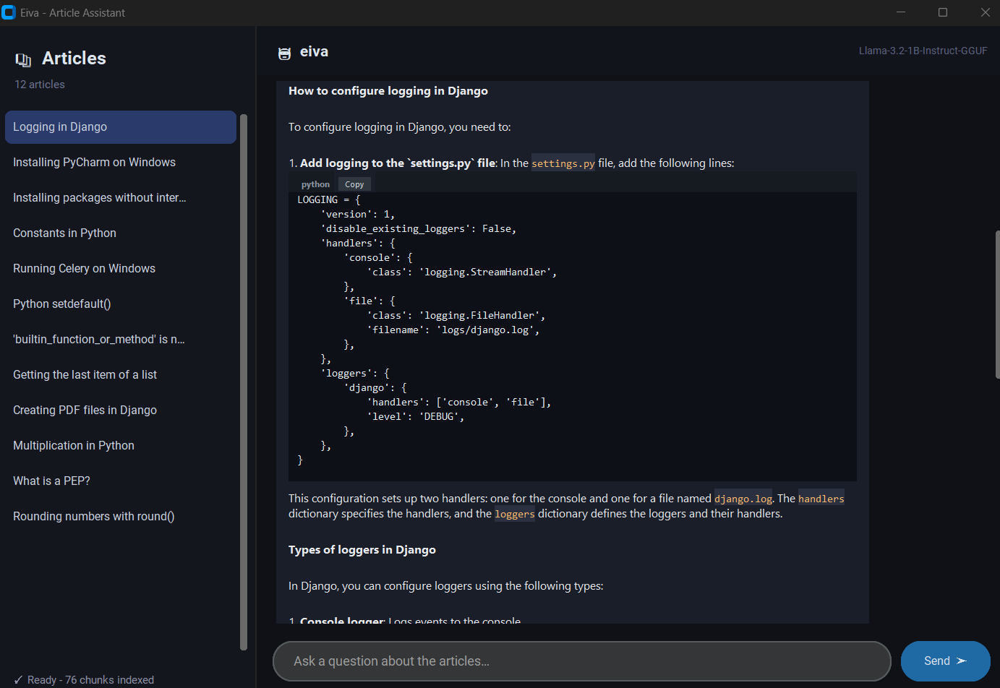
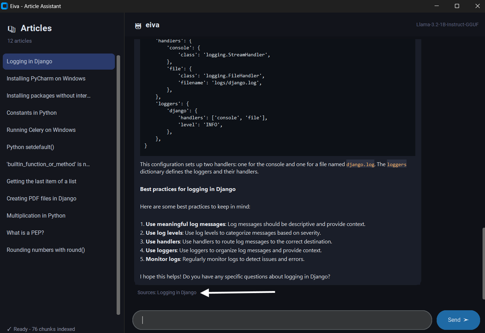
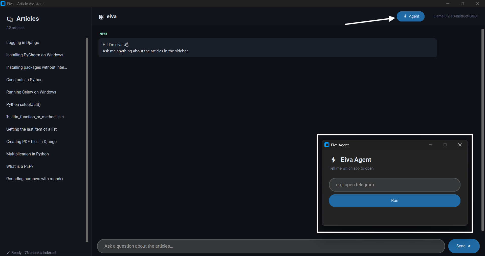

# 🤖 Eiva — Local RAG Chatbot for Technical Articles


Eiva is a **fully local Retrieval-Augmented Generation (RAG) chatbot** with a desktop GUI. It scrapes Persian programming articles, indexes them with a multilingual embedding model, and lets you ask questions **in English** about their content. Everything runs on your machine through [Ollama](https://ollama.com): no API keys, no cloud, no data leaving your computer (the optional voice input uses Google's speech recognition service).





## Agent ScreenShot :


## ✨ Features

- **End-to-end pipeline:** web scraping → text cleaning → chunking → embeddings → retrieval → streamed LLM answers → desktop UI.
- **Cross-lingual Q&A:** the articles are in Persian, questions and answers are in English (multilingual `bge-m3` embeddings).
- **Grounded answers:** the model is instructed to answer only from the retrieved context, and a similarity threshold stops it from guessing when nothing relevant is found.
- **Modern chat UI** built with `customtkinter`:
  - sidebar listing every indexed article (click to read the cleaned text),
  - the articles used for the last answer are highlighted and shown as sources,
  - streaming responses and short conversation memory,
  - Python/code answers rendered in styled code blocks with a **Copy** button.
- **Eiva Agent:** a small companion window that understands commands in English or Persian. The local LLM detects the **intent** and its target, then the agent acts on it. It can be started from the chatbot with one click.
  - `open_app`: open a desktop application ("open telegram", "برنامه تلگرام رو باز کن")
  - `play_music`: play a song ("play despacito")
  - `search_google`: search the web ("search python tutorials")
  - `unknown`: anything else is safely ignored
- **🎤 Voice commands:** click the mic button next to **Run**, speak your command, and the recognized text appears in the command field and is executed automatically.
- **Fast restarts:** embeddings are cached on disk and rebuilt only when the articles or the model change.
- **Non-blocking UI:** indexing, generation, listening and the agent run in background threads and talk to the UI through a queue.

## 🧠 How It Works

```
 get_urls.py ──► urls.txt ──► main.py ──► articles/*.txt
   (collect article links)     (scrape + save)        │
                                                      ▼
                                   chatbot.py: clean ─► chunk ─► embed (bge-m3)
                                                      │
              question ─► embed ─► cosine similarity ─┴─► top-N chunks
                                                              │
                                      prompt + context ─► LLM (Ollama) ─► streamed answer
```

1. **Collect & scrape** — `get_urls.py` gathers article links from the listing page; `main.py` downloads each article and saves it as a `.txt` file.
2. **Clean & chunk** — duplicated paragraphs and "suggested video/course" lines are removed, then paragraphs are grouped into ~900-character chunks.
3. **Embed** — each chunk (with its title) is embedded with `bge-m3` and stored as a normalized NumPy matrix, cached to disk.
4. **Retrieve** — the question is embedded and compared with every chunk by cosine similarity; the top results above a threshold are kept.
5. **Generate** — the retrieved chunks are passed to the local LLM with a strict system prompt; the answer is streamed into the chat.

### Eiva Agent

```
 keyboard ─┐
           ├─► text ─► LLM (few-shot, temperature 0) ─► {"intent", "target"} ─► action
 🎤 voice ─┘
 (Google Speech Recognition)
```

The agent reuses the same local model. A few-shot prompt makes the model reply with a small JSON object such as `{"intent": "open_app", "target": "telegram"}`. The output is parsed and validated against a fixed list of allowed intents, then the matching action runs:

| Intent | Action |
|---|---|
| `open_app` | [AppOpener](https://pypi.org/project/AppOpener/) launches the closest matching installed app |
| `play_music` | `eiva_music.py` plays the requested song |
| `search_google` | `eiva_search.py` searches Google |
| `unknown` | nothing runs, the agent reports it didn't recognize the command |

Voice input works like this: clicking 🎤 starts a background thread that records from the microphone and sends the audio to Google Speech Recognition. The recognized text is placed in the command field and executed right away. Because it runs outside the UI thread, the window never freezes while listening.

## 📁 Project Structure

```
.
├── get_urls.py        # Step 1: collects article URLs into urls.txt
├── main.py            # Step 2: scrapes every URL into articles/*.txt
├── chatbot.py         # Step 3: RAG engine + customtkinter GUI
├── eiva_agent.py      # Optional: command window (text + voice) with intent detection
├── eiva_music.py      # Agent action: play a song
├── eiva_search.py     # Agent action: search Google
├── articles/          # Scraped articles (.txt), not included in the repo
├── requirements.txt
└── README.md
```

## 🚀 Getting Started

### Prerequisites

- Python 3.10+
- [Ollama](https://ollama.com/download) installed and running
- Windows (only needed for the agent, because of AppOpener)
- A working microphone and internet connection (only needed for voice commands)

### Installation

```bash
git clone https://github.com/MikaeelDay/eiva-rag-chatbot.git
cd eiva-rag-chatbot

python -m venv .venv
.venv\Scripts\activate          # Windows
# source .venv/bin/activate     # macOS / Linux

pip install -r requirements.txt
```

Pull the models:

```bash
ollama pull bge-m3                                          # embedding model (multilingual)
ollama pull hf.co/bartowski/Llama-3.2-1B-Instruct-GGUF      # default chat model
```

For better answers you can use a larger chat model instead (see "Choosing a model" below).

### 1) Get the articles

```bash
python get_urls.py     # writes urls.txt
python main.py         # downloads articles into ./articles
```

You can also put your own `.txt` files into `articles/`.

### 2) Run the chatbot

```bash
python chatbot.py
```

On the first launch the app builds the index (a progress bar is shown in the sidebar). Later launches load it from the cache.

### 3) Run the agent (optional)

Click the **⚡ Agent** button in the chatbot header, or run it directly:

```bash
python eiva_agent.py
```

- **Typing:** write a command such as `open telegram` or `برنامه تلگرام رو برام باز کن` and press Enter or **Run**.
- **Voice:** click 🎤, say your command (for example "open telegram"), and it is shown in the field and executed automatically.

## ⚙️ Configuration

All settings are constants at the top of `chatbot.py`:

| Setting | Default | Description |
|---|---|---|
| `EMBEDDING_MODEL` | `bge-m3` | Ollama model used for embeddings |
| `LANGUAGE_MODEL` | Llama 3.2 1B (GGUF) | Ollama model used to write answers |
| `CHUNK_SIZE` | `900` | Max characters per chunk |
| `TOP_N` | `4` | Chunks passed to the LLM |
| `MIN_SIMILARITY` | `0.30` | Minimum cosine similarity for a chunk to be used |
| `HISTORY_TURNS` | `6` | Previous messages kept as conversation memory |
| `TITLE_MAP` | — | English display names for the sidebar |

The agent has its own settings at the top of `eiva_agent.py`:

| Setting | Default | Description |
|---|---|---|
| `LANGUAGE_MODEL` | Llama 3.2 1B (GGUF) | Model used to detect the intent |
| `SPEECH_LANGUAGE` | `en-US` | Language of voice input (use `fa-IR` for Persian) |
| `EXAMPLES` | — | Few-shot examples; add the commands and apps you use to make detection more reliable |

### Choosing a model

The default is a small 1B model, which runs on almost any machine but struggles to read Persian context and answer in English. For noticeably better answers use a larger model such as `llama3.2:3b` or `qwen2.5:7b`: run `ollama pull <model>` and set `LANGUAGE_MODEL` to its name.

## 🛠️ Tech Stack

| Area | Tools |
|---|---|
| Language | Python |
| Scraping | `requests`, `BeautifulSoup4` |
| Embeddings & LLM | Ollama (`bge-m3`, Llama 3.2) |
| Vector search | NumPy (cosine similarity on a normalized matrix) |
| GUI | `customtkinter`, `tkinter` |
| Desktop automation | `AppOpener` |
| Voice input | `SpeechRecognition`, `PyAudio` (Google Speech Recognition) |
| Concurrency | `threading`, `queue` |

## 🔍 Design Notes

- **Why multilingual embeddings?** An English-only embedding model retrieved poorly on Persian text; switching to `bge-m3` made cross-language retrieval possible.
- **Why chunking?** Embedding each whole article produced huge, unfocused vectors and overloaded the small LLM's context. Paragraph-based chunks give more precise retrieval.
- **Why a similarity threshold?** Without it the model happily answers from its own knowledge instead of the articles.
- **Why a plain NumPy index?** For a few hundred chunks, a matrix multiplication is simple, fast and dependency-free; a vector database would be overkill.
- **Why few-shot prompting for the agent?** A 1B model follows examples far better than written rules. Combined with `temperature=0`, a short output limit and a JSON format, it reliably returns an intent and a target.
- **Why validate the model's output?** The agent only accepts intents from a fixed allow-list; anything else becomes `unknown`, so a wrong answer from the small model can't trigger an unexpected action.
- **Why listen in a background thread?** Recording and recognizing speech takes several seconds. Running it in the UI thread would freeze the window, so the result is sent back through a queue and the command runs on the UI side.
- **UI details:** message bubbles are sized in pixels rather than lines, so code blocks and mixed fonts don't leave empty space.

## ⚠️ Limitations & Ideas for Improvement

- Adding or editing an article re-embeds **all** articles (no per-file incremental indexing yet).
- The article list is read at startup; new files appear after a restart (a Refresh button would fix this).
- Eiva is strictly article-focused: messages with no relevant article (including greetings and small talk) get a "couldn't find anything in the articles" reply. Allowing general conversation when no context is found is a planned improvement.
- Retrieval is purely semantic; adding keyword search (hybrid retrieval) and a re-ranker could improve results.
- Answer quality depends heavily on the chosen local model.
- The agent currently targets Windows (AppOpener) and can only open apps installed on the machine.
- With the default 1B model, intent and app-name extraction can fail on rare or unusual commands; add your own to `EXAMPLES` in `eiva_agent.py` or use a larger model.
- Voice recognition understands one language at a time (`SPEECH_LANGUAGE`) and needs an internet connection; an offline engine (such as Vosk or Whisper) is a possible improvement.
- Planned: more agent intents (volume, files, system settings).

## 📄 Disclaimer

The articles used for development were collected from [mongard.ir](https://www.mongard.ir/) for personal and educational purposes. The content belongs to its original authors and is **not included** in this repository. If you scrape any site, respect its terms of service and `robots.txt`.

## 👤 Author

**Mikaeel Raisee** — Python / Django developer moving toward API development and AI/ML engineering.
GitHub: [@MikaeelDay](https://github.com/MikaeelDay)